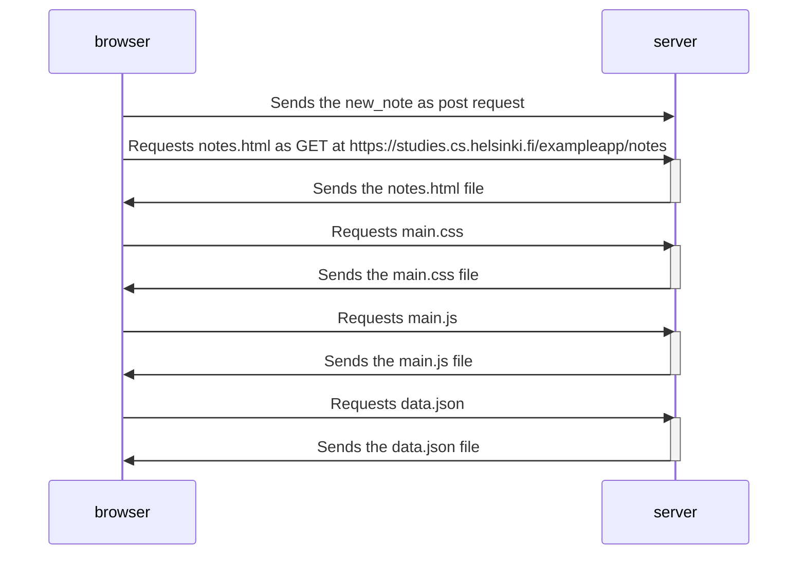

```mermaid
sequenceDiagram
    participant browser
    participant server

        browser->>server: Sends the new_note as post request
        browser->>server: Requests notes.html as GET at https://studies.cs.helsinki.fi/exampleapp/notes
        
        activate server
        server->>browser: Sends the notes.html file
        deactivate server
        browser->>server: Requests main.css
        activate server
        server->>browser: Sends the main.css file
        deactivate server
        browser->>server: Requests main.js
        activate server
        server->>browser: Sends the main.js file
        deactivate server
        browser->>server: Requests data.json
        activate server
        server->>browser: Sends the data.json file
        deactivate server
        
```
