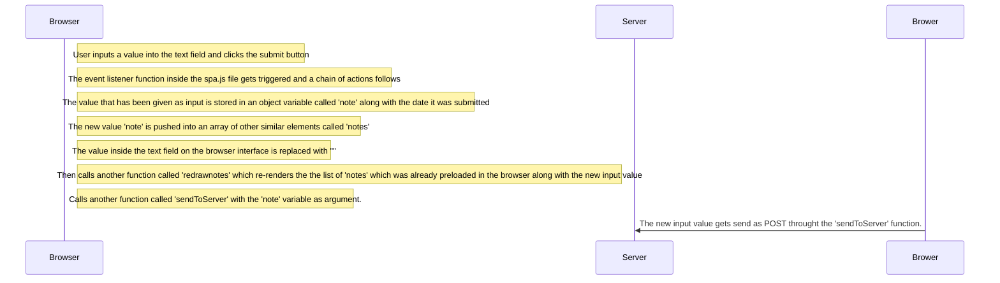

```mermaid

    sequenceDiagram

        participant Browser
        participant Server

        Note right of Browser: User inputs a value into the text field and clicks the submit button

        Note right of Browser: The event listener function inside the spa.js file gets triggered and a chain of actions follows

        Note right of Browser: The value that has been given as input is stored in an object variable called 'note' along with the date it was submitted

        Note right of Browser: The new value 'note' is pushed into an array of other similar elements called 'notes'

        Note right of Browser: The value inside the text field on the browser interface is replaced with ""

        Note right of Browser: Then calls another function called 'redrawnotes' which re-renders the the list of 'notes' which was already preloaded in the browser along with the new input value

        Note right of Browser: Calls another function called 'sendToServer' with the 'note' variable as argument.

        Brower->>Server: The new input value gets send as POST throught the 'sendToServer' function.


```
