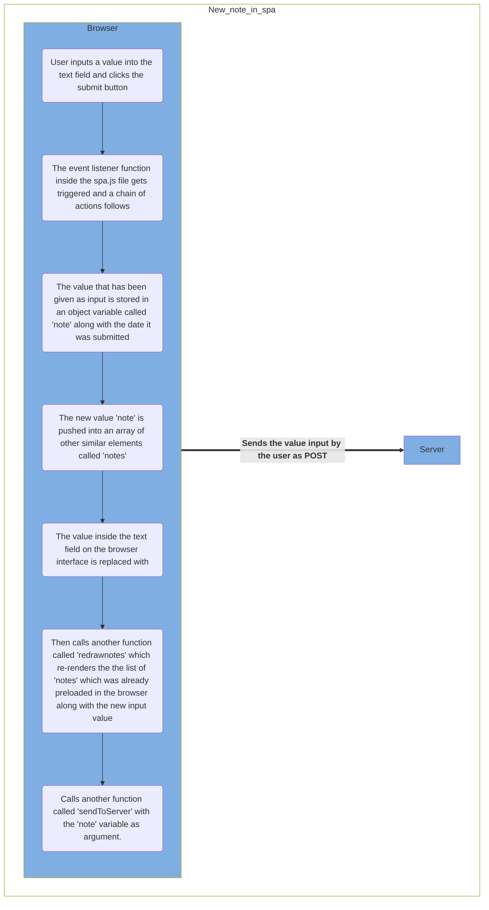

```mermaid

    flowchart

    subgraph Browser
    direction TB

        step1(User inputs a value into the text field and clicks the submit button)

        step2(The event listener function inside the spa.js file gets triggered and a chain of actions follows)

        step3(The value that has been given as input is stored in an object variable called 'note' along with the date it was submitted)

        step4(The new value 'note' is pushed into an array of other similar elements called 'notes')

        step5(The value inside the text field on the browser interface is replaced with "")

        step6(Then calls another function called 'redrawnotes' which re-renders the the list of 'notes' which was already preloaded in the browser along with the new input value)

        step7(Calls another function called 'sendToServer' with the 'note' variable as argument.)

        step1 --> step2 --> step3 --> step4 --> step5 --> step6 --> step7
    end

    subgraph New_note_in_spa
    direction LR
        Browser ====> |"` **Sends the value input by the user as POST** `"| Server
    end

    style New_note_in_spa fill: #fff
    style Browser fill: #7faee3
    style Server fill: #7faee3


```
