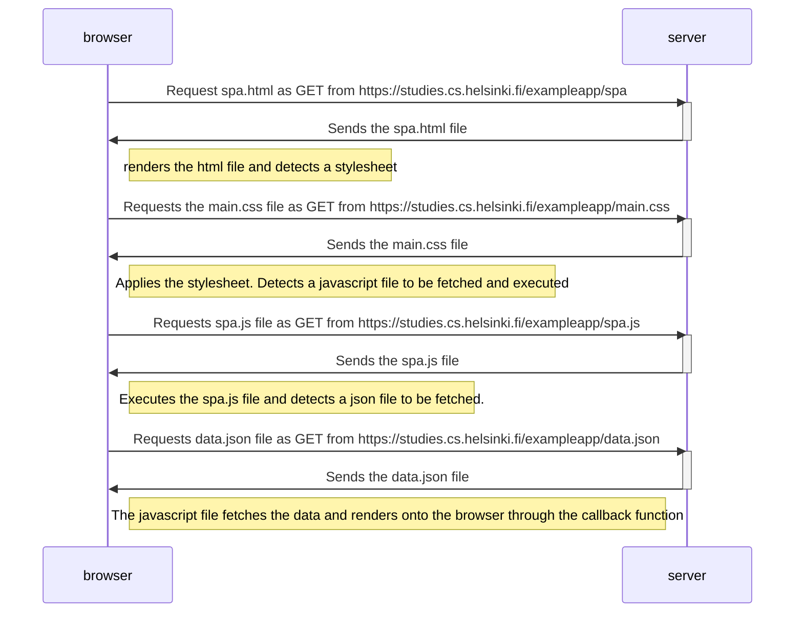

```mermaid
    sequenceDiagram
    
    participant browser
    participant server
    
        browser->>server: Request spa.html as GET from https://studies.cs.helsinki.fi/exampleapp/spa
        activate server
        server->>browser: Sends the spa.html file
        deactivate server
        
        Note right of browser: renders the html file and detects a stylesheet
        
        browser->>server: Requests the main.css file as GET from https://studies.cs.helsinki.fi/exampleapp/main.css
        activate server
        server->>browser: Sends the main.css file
        deactivate server
        
        Note right of browser: Applies the stylesheet. Detects a javascript file to be fetched and executed
        
        browser->>server: Requests spa.js file as GET from https://studies.cs.helsinki.fi/exampleapp/spa.js
        activate server
        server->>browser: Sends the spa.js file
        deactivate server
        
        Note right of browser: Executes the spa.js file and detects a json file to be fetched.
        
        browser->>server: Requests data.json file as GET from https://studies.cs.helsinki.fi/exampleapp/data.json
        activate server
        server->>browser: Sends the data.json file
        deactivate server
        
        Note right of browser: The javascript file fetches the data and renders onto the browser through the callback function
        
        
```
